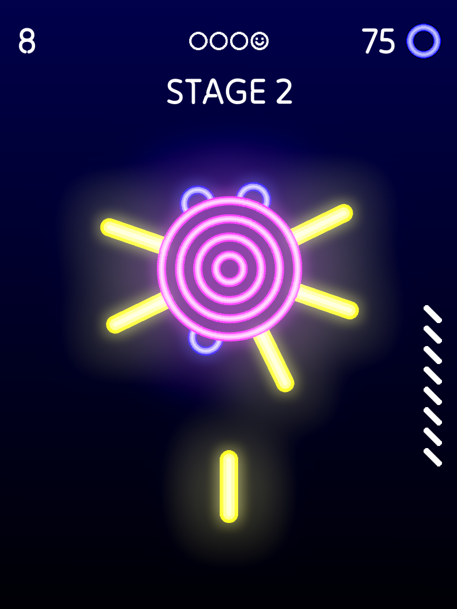

# Neon Hit
Arcade game that I made with Godot 4.1 and GDScript.

## Overview

## Using
For control you can use: mouse or touchscreen.

### Install
- Download Godot 4.1
- Specify the path to the game folder
